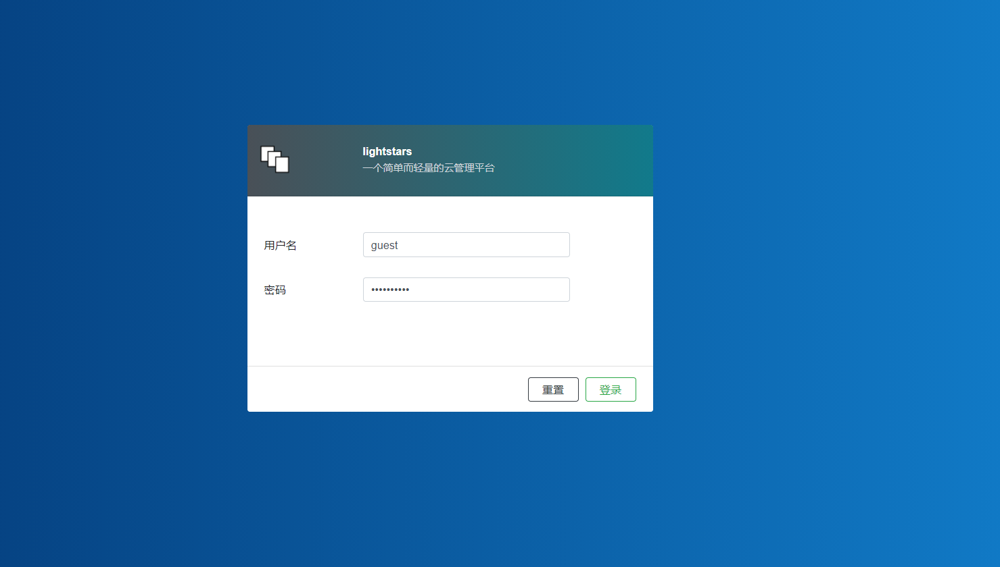
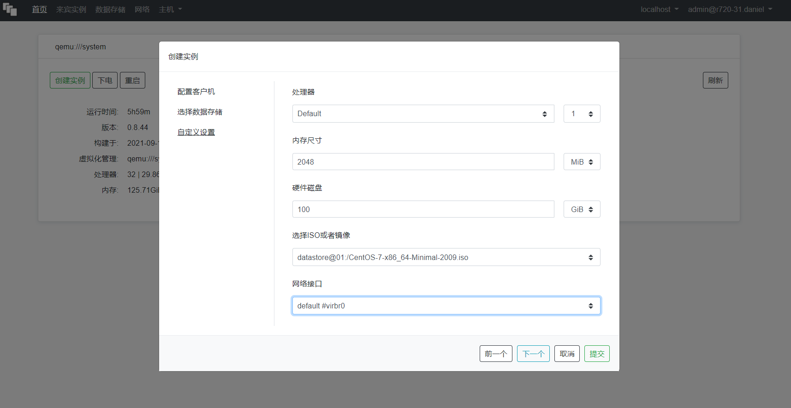
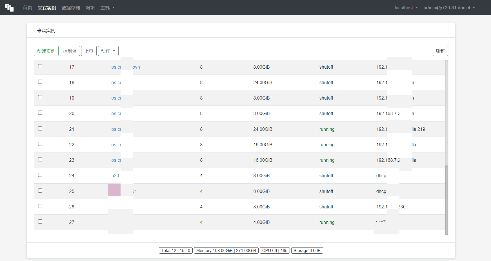
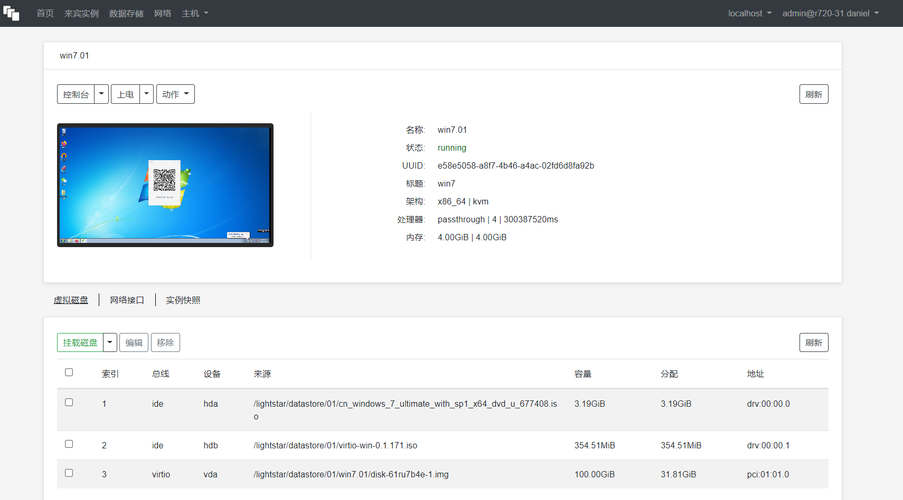

# LightStars

This software makes it easier for you to control virtual compute, network and storage resource.

# CentOS7

## Check Intel VT-x or AMD-V

    lscpu | egrep '(vmx|svm)'

## Disable SELinux firstly

    cat > /etc/sysconfig/selinux <<EOF
    SELINUX=disabled
    SELINUXTYPE=targeted
    EOF
    
    reboot

## Install epel and qemu-ev release

    yum install -y epel-release centos-release-qemu-ev

## Install Open vSwitch

    yum install -y centos-release-openstack-train
    yum install -y openvswitch

    systemctl enable openvswitch
    systemctl start libvirtd

## Install by RPM packaging

    yum install -y https://github.com/danieldin95/lightstars/releases/download/v0.8.40/lightstar-0.8.40-1.el7.x86_64.rpm

## Enable and Start service.

    systemctl enable libvirtd
    systemctl enable lightstar

    systemctl start libvirtd
    systemctl start lightstar

## Upload a Linux ISO file

    cd /lightstar/datastore/01
    wget http://mirrors.aliyun.com/centos/7.7.1908/isos/x86_64/CentOS-7-x86_64-Minimal-1908.iso

# Open WebUI in browser

    https://your-machine-address:10010

## Get Username and Password

    cat /etc/lightstar.auth
