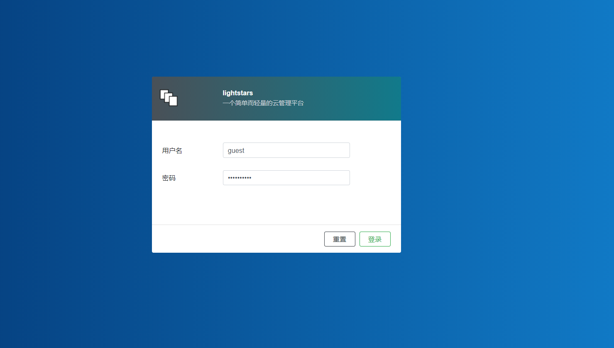
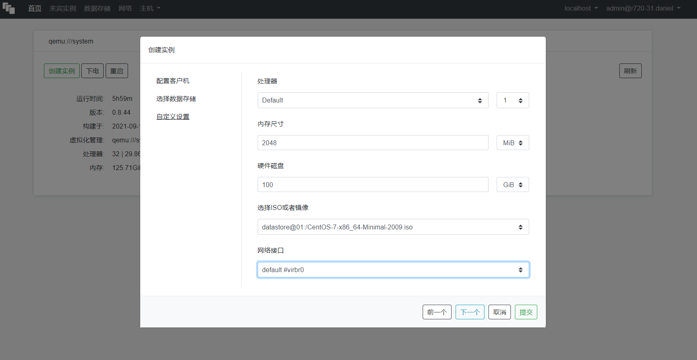
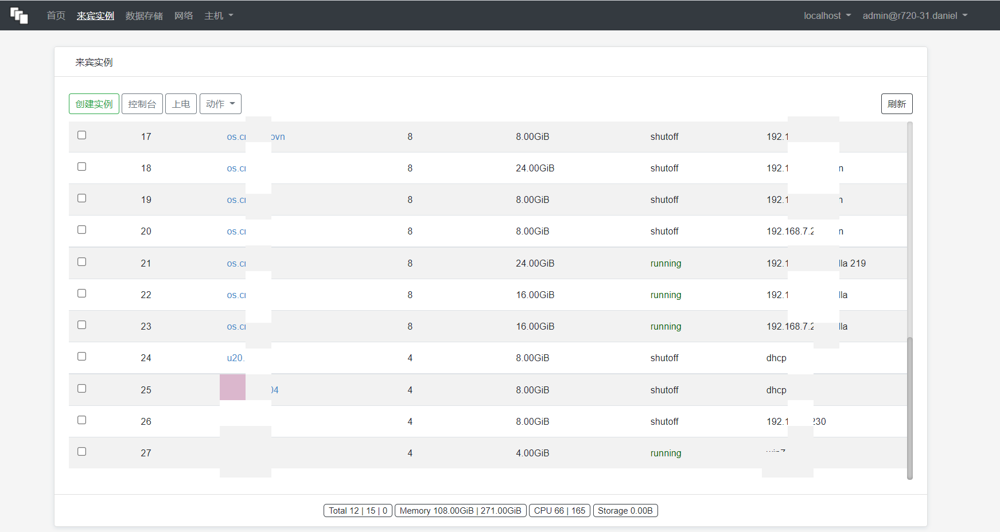
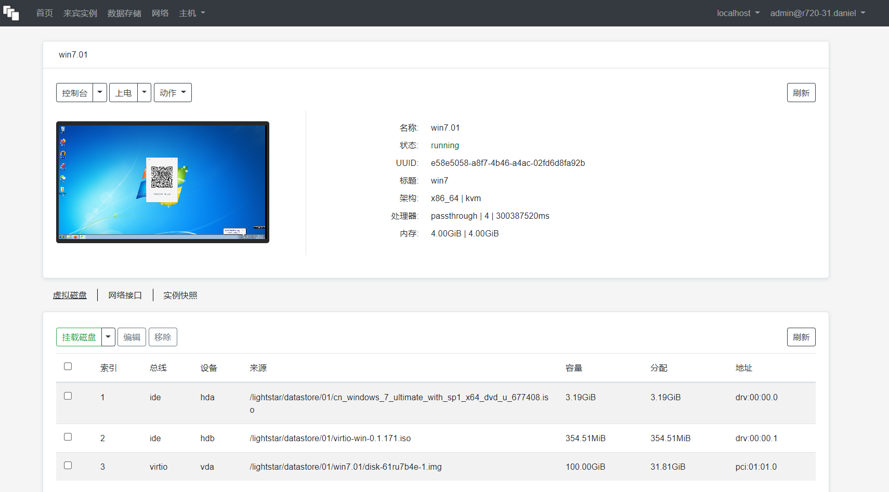

# LightStar

This software makes it easier for you to control virtual compute, network and storage resource.

## Ubuntu Server

## Check Intel VT-x or AMD-V

    lscpu | egrep '(vmx|svm)'

## Disable SELinux firstly

    cat > /etc/sysconfig/selinux <<EOF
    SELINUX=disabled
    SELINUXTYPE=targeted
    EOF
    
    reboot

## Install from binary package

    curl -L -o /tmp/lightstar.bin \
      https://github.com/danieldin95/lightstars/releases/download/v0.9.4/lightstar-debian-0.9.4.bin
    chmod +x /tmp/lightstar.bin
    /tmp/lightstar.bin

## Enable and Start service

    systemctl enable --now libvirtd
    systemctl enable --now lightstar

## Upload a Linux ISO file

    cd /lightstar/datastore/01
    wget http://mirrors.aliyun.com/centos/7.7.1908/isos/x86_64/CentOS-7-x86_64-Minimal-1908.iso

## Open WebUI in browser

    https://your-machine-address:10010

## Get Username and Password

    cat /etc/lightstar.auth
